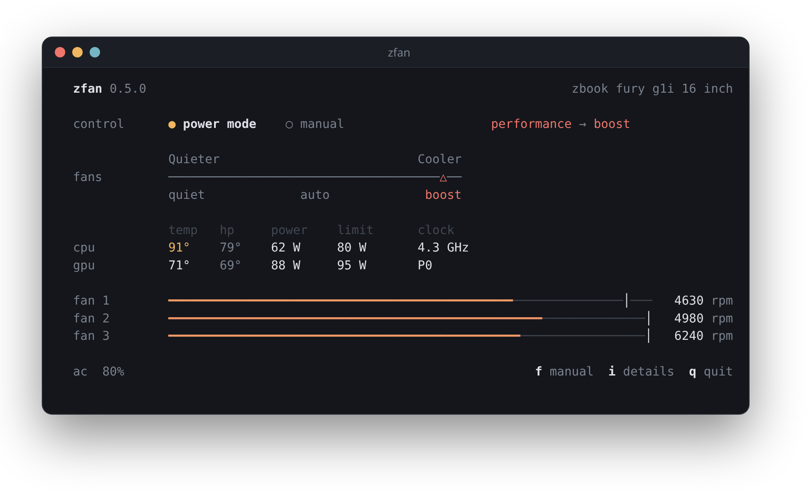
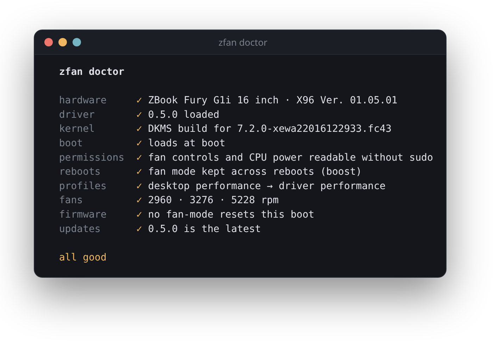
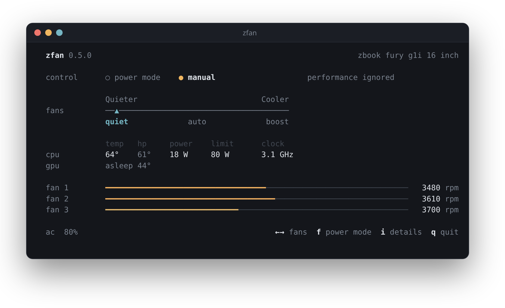
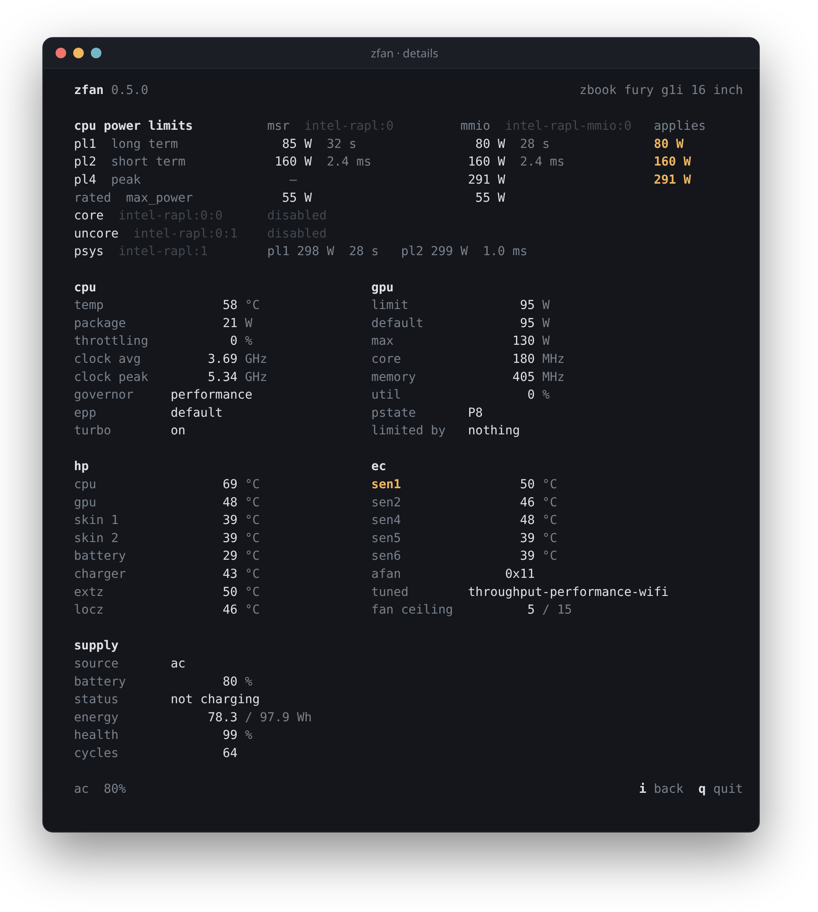

<div align="center">

# zfan

**Fan control for HP ZBook laptops on Linux.**<br>
A small kernel driver and a terminal dashboard: let the desktop power mode drive the fans, or pick the level yourself.

[](https://github.com/piexelated/zfan/actions/workflows/ci.yml)


[](LICENSE)



</div>

## Requirements

- An HP ZBook. Tested on the ZBook Fury G1i 16" (board `8DE2`, BIOS 01.05.01); other ZBooks should work too. The
  driver first checks that the laptop's fan controller matches the one it knows, and `install.sh` stops without
  installing anything if it doesn't.
- Linux 6.14+ with headers for the running kernel, DKMS, gcc, make and Python 3.10+
  - Fedora: `sudo dnf install dkms kernel-devel-$(uname -r) gcc make python3`
  - Debian / Ubuntu: `sudo apt install dkms linux-headers-$(uname -r) build-essential python3`
  - Arch: `sudo pacman -S dkms linux-headers base-devel python`
- Optional: a power-profile service (`tuned-ppd` or `power-profiles-daemon`) so the fans follow the desktop power
  mode, and `nvidia-smi` for GPU power and clocks

## Install

```sh
git clone https://github.com/piexelated/zfan.git
cd zfan
sudo ./install.sh
zfan
```

`install.sh` checks the requirements first and tells you what's missing. With Secure Boot on, enroll DKMS's signing
key once: `sudo mokutil --import /var/lib/dkms/mok.pub`, reboot and choose *Enroll MOK*. Run `zfan doctor` if
anything looks off.

<details>
<summary><code>zfan doctor</code> checks the whole setup and prints a fix for anything wrong</summary>
<br>

</details>

## Use

The `control` row shows who sets the fan level:

- **power mode** (default): the fans follow the desktop power mode. Power saver and balanced give auto, performance
  gives boost.
- **manual**: the level you pick stays, whatever the power mode.

<p align="center">

</p>

| Key | Action |
|---|---|
| `f` | switch between power mode and manual |
| `←` `→` | in manual: quieter or cooler |
| `i` | details: power limits, clocks, HP and EC sensors, battery |
| `q` | quit |

| Fan level | Fans |
|---|---|
| quiet | capped around 4300 RPM |
| auto | HP's automatic curve |
| boost | up to ~6100 / 6500 / 8500 RPM under load; same as auto when cool |

The choice survives reboots and updates.

Press `i` for the details view: every CPU power limit, clocks, the GPU, HP's and the EC's temperature sensors, and
the battery.

<p align="center">

</p>

## Commands

| Command | Effect |
|---|---|
| `zfan status` / `zfan details` | print the dashboard once |
| `zfan fans follow\|quiet\|auto\|boost` | set the fan mode |
| `zfan doctor` | check the setup and print a fix for each problem |
| `zfan update` | install the latest release |
| `zfan uninstall` | remove the driver and zfan |

Only `doctor` and `update` go online.

## License

[GPL-2.0-or-later](LICENSE)
